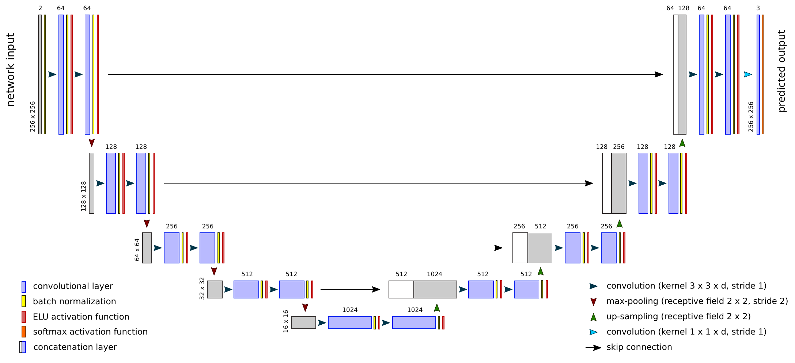
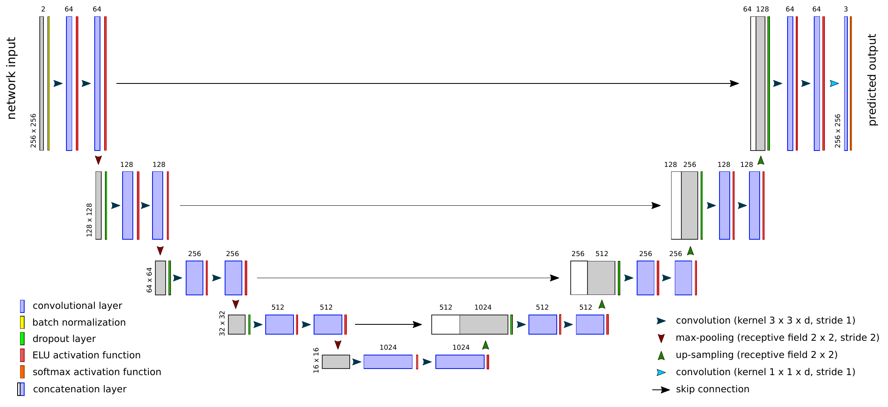
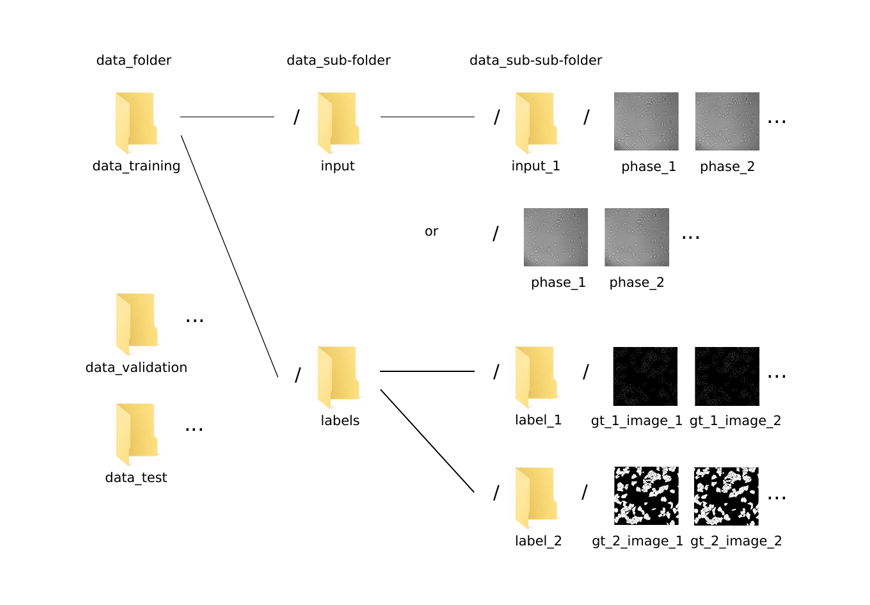
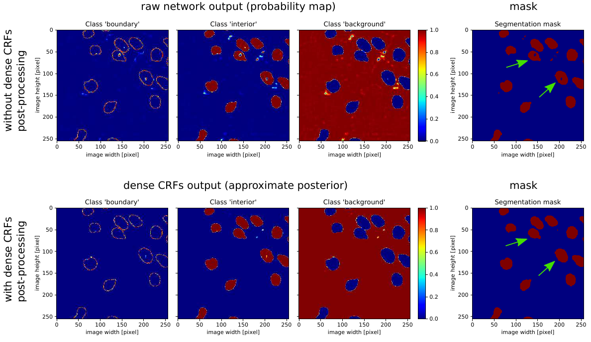
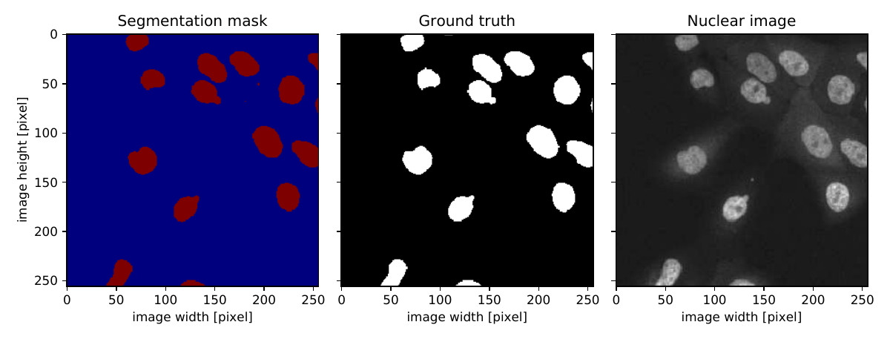
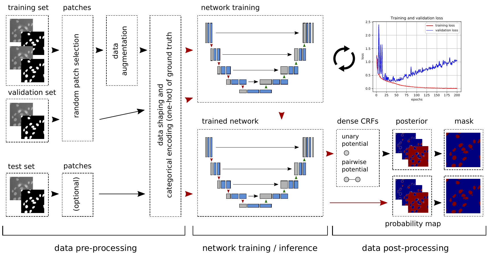

## adapted_u-net_dense_crfs

Fully convolutional encoder-decoder network with dense conditional random fields post-processing for cell segmentation

### Network Architecture

The network architecture is based on the *U-Net* architecture proposed by O. Ronneberger et al. [1]. Practical applications and research findings have shown that certain adaptions can lead to better performance. The following changes were made to the original architecture:  

* For most applications it is more convenient when input image size matches output image
size. In the original architecture zero-padding is not applied while performing convolutional or max-pooling operations. This results in a spatially smaller output image size compared to
the input size. Various applications have shown that there is no real loss of performance when employing zero-padding (border mode = same) instead of using un-padded images (border mode = valid). The network used in this work applies zero-padding in all convolutional, max-pooling, and upsampling layers.
* A batch normalization layer [2] is added before the first convolutional layer to normalize the input samples (mini-batch).
* To evaluate the performance of batch normalization versus dropout as regularizers for cell
segmentation applications, in one version of the network architecture every convolutional
layer is followed by a batch normalization layer whereas in another
version a dropout layer is implemented after every max-pooling respectively upsampling
layer.  

In a 2018 paper, Li et al. [3] discover that batch normalization and dropout can
lead to worse performance when combined together in a deep network. The network architectures
employed in this work either use batch normalization layers or apply batch normalization to the input only (for input data normalization purposes) and then use dropout layers.  

Adapted U-Net architecture with batch normalization layers:  

  

Adapted U-Net architecture with dropout layers  

  

### Data Preparation / Pre-Processing

Data preparation / pre-processing consists of data set splitting (training set, validation / dev set, test (hold-out) set), patch selection (network is trained on image patches), data augmentation (only training set), image normalization (dividing the pixel intensities by the maximum pixel value), and one-hot encoding of the ground truth. Data set splitting needs to be done manually. For the remaining tasks, the script files `main_netw_preprocess_exec.py` (file for data pre-processing) and `main_netw_predict_conv_exec.py` (file to convert or pre-process an image set without ground truth (new images)) may be used. The pre-processed dataset is saved as a compressed numpy array file (.npz) where the network input images (patches) respectively the ground truth images (patches) are represented as 4-dimensional arrays (converted to 4-dimensional tensors when being fed to the network). The input images array has shape ns * Ih * Iw * Id whereas the array with the one-hot encoded ground truth data is of shape ns * Ih * Iw * Ic. The parameter ns denotes the number of samples, Ih the image height, Iw the image width, Id the
image or input depth (number of channels, e.g. one gray-scale phase contrast and one gray-scale nuclear image, in this case Id = 2), and Ic the number of classes.  

The following directory structure should be used:  

  

### Network Training

Upload the files `main_netw_train.py`, `network_models.py`, `keras_custom.py`, `dataset_train.npz` (file with training data), and `dataset_val.npz` (file with validation data) to the computer / instance where the training will be carried out. Start the training process by running `main_netw_train.py` (via command line, with corresponding arguments).

### Inference and Post-Processing

Inference (applying trained network to test or new data) may be carried out on larger images
than used for training (due to weight sharing in feature maps) by reinitializing the network model and loading the trained weights. The network input height respectively width (in pixels) needs to be a multiple of 32 in any case. This is a consequence of the underlying network architecture (max-pooling / upsampling layers). Furthermore, best performance is achieved when training and test (or any new input fed to a trained network) images exhibit same scale and image content. Different input image scales may add a lot of scale / translation invariance, which generally results in poor performance. In addition, the network will not be able to learn features that are presented in a (larger) test image if they are not respectively incompletely represented in the training data.  
Data post-processing is applied to the output of a trained network and is a separate process. In particular, this means that the dense Conditional Random Fields (CRFs) post-processing is not implemented as a layer in the network model and is therefore not involved in the training process. Furthermore, a segmentation mask is computed from the predicted probability map. When no dense CRFs post-processing is employed, the predicted probability map comes as the network output, otherwise it is the result of the dense CRFs post-processing step. The conditional random field post-processing is implemented using dense conditional random fields
in combination with approximate mean-field inference as proposed by Krähenbühl and Koltun [4] and [5]. The final output of the dense CRFs post-processing step can be seen as an approximate posterior of the softmax input (unary potential). The dense CRFs post-processing is implemented via the *pydensecrf* package provided by L. Beyer [6].  

  

  

The cell nucleus images used to train the network (to produce the images shown above) were taken from an image repository provided by VanValen et al. [7].

### Entire Data Processing Pipeline

  

[1]: O. Ronneberger, P. Fischer, and T. Brox, "U-Net: Convolutional networks for biomedical image segmentation", University of Freiburg, vol. 1, no. 2015, pp. 1-8, 2015  
[2]: C. Szegedy and S. Ioffe, "Batch normalization: Accelerating deep network training by reducing internal covariance shift", Google Research, vol. 1, no. 2015, pp. 1-11, 2015  
[3]: X. Li, S. Chen, X. Hu, and J. Yang, "Understanding the disharmony between dropout and batch normalization by variance shift", ArXiv: 1801.05134v1, vol. 1, no. 2018, pp. 1-9, 2018  
[4]: P. Krähenbühl and V. Koltun, "Efficient inference in fully connected CRFs with Gaussian edge potential", arXiv: 1210.5644v1, vol. 1, no. 2012, pp. 1-9, 2012  
[5]: P. Krähenbühl and V. Koltun, "Parameter learning and convergent inference for dense random fields", Computer Science Department, Stanford University, vol. 1, no. 2013, pp. 1-9, 2013  
[6]: L. Beyer, "Pydensecrf: A (cython-based) Python wrapper for Philipp Krähenbühl's fully-connected conditional random fields." https://github.com/lucasb-eyer/pydensecrf, accessed: 10/07/2018  
[7]: D. VanValen et al., "Deep learning automates the quantitative analysis of individual cells in live-cell imaging experiments", PLOS Computational Biology, vol. 12, no. 11, pp. 1-12, 2016
